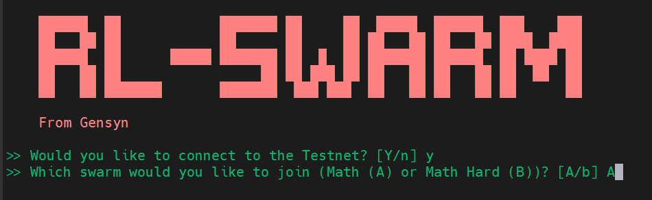

# Gaianet

## Скрипт

```bash
source <(curl -s https://raw.githubusercontent.com/cryptoportalua/scripts/refs/heads/main/gaianet)
```

[Перевірка роботи ноди](gaianet.md#perekhodimo-u-brauzer-za-posilannyam-z-terminalu)

## Ручне встановлення

```bash
# Install node
curl -sSfL 'https://github.com/GaiaNet-AI/gaianet-node/releases/latest/download/install.sh' | bash
```

Зберігаємо собі `device-id` та `node-id`

<figure><figcaption></figcaption></figure>

<details>

<summary>Міняємо стандартну модель на Qwen2 0.5B щоб фармити більше поінтів</summary>

```bash
ADDRESS=$(gaianet info | grep "Node ID" | awk -F': ' '{print $2}')
```

```bash
sudo tee ~/gaianet/config.json > /dev/null <<EOF
{
  "address": "$ADDRESS",
  "chat": "https://huggingface.co/gaianet/Qwen2-0.5B-Instruct-GGUF/resolve/main/Qwen2-0.5B-Instruct-Q5_K_M.gguf",
  "chat_batch_size": "32",
  "chat_ctx_size": "131072",
  "description": "This GaiaNet node config with a Qwen2 0.5B model.",
  "domain": "gaia.domains",
  "embedding": "https://huggingface.co/gaianet/Nomic-embed-text-v1.5-Embedding-GGUF/resolve/main/nomic-embed-text-v1.5.f16.gguf",
  "embedding_batch_size": "8192",
  "embedding_collection_name": "default",
  "embedding_ctx_size": "8192",
  "llamaedge_port": "8082",
  "prompt_template": "chatml",
  "qdrant_limit": "1",
  "qdrant_score_threshold": "0.5",
  "rag_policy": "system-message",
  "rag_prompt": "Use the following pieces of context to answer the user's question.\nIf you don't know the answer, just say that you don't know, don't try to make up an answer.\n----------------\n",
  "reverse_prompt": "",
  "snapshot": "",
  "system_prompt": "You are a helpful, respectful, and honest assistant. Always answer accurately, while being safe."
}
EOF
```


</details>

```bash
source ~/.bashrc && gaianet init
```

```bash
gaianet start
```

#### Переходимо у браузер за посиланням з терміналу

<figure><figcaption></figcaption></figure>

<figure><figcaption></figcaption></figure>

Тиснемо старт і спілкуємось із чатом, за кожен запит нараховуються поінти. Але спершу добавимо ноду в дашбоард сайту Gaianet.


[https://www.gaianet.ai/gaia-domain-name](https://www.gaianet.ai/gaia-domain-name)


<figure><figcaption></figcaption></figure>

Заходимо на сайт і конектимо ваш будь-який тестовий гаманець.&#x20;

<figure><figcaption></figcaption></figure>

<figure><figcaption></figcaption></figure>

Натискаємо "Connect new node" Тепер добавляємо `node-id` та `device-id`

<figure><figcaption></figcaption></figure>

Після того у вас з'являється ваша нода в дашбоард, можна прослідкувати що ваша нода онлайн по зеленому статусу. Тепер добавляємо домейн для качання поінтів. Тиснемо три крапки справа і натискаємо "Join Domain"&#x20;

<figure><figcaption></figcaption></figure>

<div><figure><figcaption></figcaption></figure> <figure><figcaption></figcaption></figure></div>

Тиснемо "Next Step", одразу нам дається вибір чий саме домейн можна вибрати. Вам треба вибрати той домейн на якому стоїть правильна версія Qwen2-0.5B,  по іншому вас непропустить система. Вибираєте де не дуже багато людей, орієнтовно до 100, там більше поінтів капає.&#x20;

<figure><figcaption></figcaption></figure>

Нода у вас вже стоїть з домейном, тепер ідем в GaiaXp.

<figure><figcaption></figcaption></figure>

<figure><figcaption></figcaption></figure>

У вкладці Tasks конектимо всі соціалки. Ви отримуєте за це gaiaPoints, також за спілкування з чатом у вас будуть капати Node Points. Для того щоб ці поінти капали вам ще треба буде закинути пару центів в ефірі на гаманець в мережі Base. Це для того що б обмінювати поінти на gaiaCredits для отримування поінтів. Це можна робити не часто,  а коли у вас накопиться максимальна можливий свап 1000/500.

<figure><figcaption></figcaption></figure>

<figure><figcaption></figcaption></figure>

Ось так виглядає всі запити в чаті які перетворюються в поінти. Ця інформація присутня в вкладці  gaiaPoints.\
\
Також собі на сервер можна поставити бота фармилку, який буде робити запити за вас. Як тільки ми його оновим одразу додамо в гайд.
